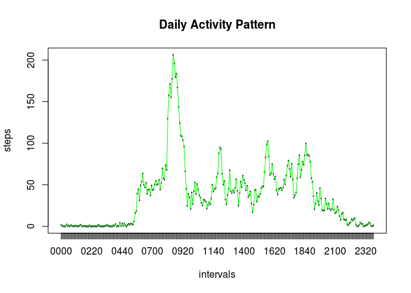

## Introduction
This assignment makes use of data from a personal activity monitoring device. This device collects data at 5 minute intervals through out the day. The data consists of two months of data from an anonymous individual collected during the months of October and November, 2012 and include the number of steps taken in 5 minute intervals each day. The data for this assignment are in the working directory.

## Loading and preprocessing the data
First we Unzip the file **activity.zip** in the working directory and read the **activity.csv** like a dataframe.

```r
# Asume that the activity.zip file is in the working directory and load the activity.csv in the data frame DFactivity
unzip('activity.zip', overwrite = TRUE)
DFactivity<-read.csv('activity.csv',header=TRUE,na.strings = 'NA')
```
The variables included in this dataframe are:

- **steps**: Number of steps taken in a 5-minute interval (missing values are coded as NA).
- **date**: The date on which the measurement was taken in YYYY-MM-DD format.
- **interval**: Identifier for the 5-minute interval in which measurement was taken.

We can see a sample of data with the *head()* R function:

```r
head(DFactivity)
```

```
##   steps       date interval
## 1    NA 2012-10-01        0
## 2    NA 2012-10-01        5
## 3    NA 2012-10-01       10
## 4    NA 2012-10-01       15
## 5    NA 2012-10-01       20
## 6    NA 2012-10-01       25
```
Now we will transform the variable **date** from data frame in a date class.

```r
DFactivity$date<-as.Date(DFactivity$date)
```

## What is mean total number of steps taken per day?
In this first part we will remove the missing values (NA) with the help of *complete.cases()* R function. We will save the result in a new data frame named **DFactivity_complete**.

```r
DFactivity_complete <- DFactivity[complete.cases(DFactivity), ]
```
Also, we will change the format of values from the variable **interval** with the help of the R function *sprintf()*

```r
DFactivity_complete$interval <- sprintf("%04d",DFactivity_complete$interval)
```
Now we can see in the new data frame **DFactivity_complete** only the complete data. We can inspect its content with the R function *head()*.

```r
head(DFactivity_complete)
```

```
##     steps       date interval
## 289     0 2012-10-02     0000
## 290     0 2012-10-02     0005
## 291     0 2012-10-02     0010
## 292     0 2012-10-02     0015
## 293     0 2012-10-02     0020
## 294     0 2012-10-02     0025
```
With the help of the R library **dplyr** we will make a new data frame with the resume of the daily activity. First we load the library.

```r
# Load the library dplyr
library(dplyr)
```
We will use the R function *group_by()* and *summarise()* to get the total steps taken daily.

```r
DFactivity_complete_dialy <- DFactivity_complete %>%  group_by(date) %>% summarise(steps_day=sum(steps))
```
In the data frame **DFactivity_complete_dialy** we can see the total number of steps taken by day.

```r
head(DFactivity_complete_dialy)
```

```
## # A tibble: 6 x 2
##   date       steps_day
##   <date>         <int>
## 1 2012-10-02       126
## 2 2012-10-03     11352
## 3 2012-10-04     12116
## 4 2012-10-05     13294
## 5 2012-10-06     15420
## 6 2012-10-07     11015
```
In the following figure we can see an histogram of the total number of steps taken each day using the R function *hist()*.

```r
hist(DFactivity_complete_dialy$steps_day, breaks=10, col='blue', labels = TRUE, main='Histogram of Daily Steps (omitting missing values)', ylab='Frequency (days)', xlab='Daily Steps', freq = TRUE, xlim=c(0,25000),ylim = c(0,30))
```

<!-- -->

And finally we can see a report with the mean and median of the total number of steps taken per day with the R function *summary()*.

```r
summary(DFactivity_complete_dialy$steps_day)
```

```
##    Min. 1st Qu.  Median    Mean 3rd Qu.    Max. 
##      41    8841   10765   10766   13294   21194
```

## What is the average daily activity pattern?
We can get the average of steps for each interval and save it in a new data frame named **Pattern_activity_complete**.

```r
Pattern_activity_complete <- DFactivity_complete %>% group_by(interval) %>% summarise(mean_steps=mean(steps))
head(Pattern_activity_complete)
```

```
## # A tibble: 6 x 2
##   interval mean_steps
##   <chr>         <dbl>
## 1 0000         1.72  
## 2 0005         0.340 
## 3 0010         0.132 
## 4 0015         0.151 
## 5 0020         0.0755
## 6 0025         2.09
```
Now we can present the pattern graph with the R functions *plot()* and *lines()*.

```r
plot(as.factor(Pattern_activity_complete$interval),Pattern_activity_complete$mean_steps, xlab='intervals', ylab='steps', main='Daily Activity Pattern')
lines(as.factor(Pattern_activity_complete$interval), Pattern_activity_complete$mean_steps, xlab='intervals', lty = "solid", col='green')
```

<!-- -->

To know what is the interval which contains the maximum number of steps, we will use the R functions *max()* with *filter()* from the library dplyr.

```r
 filter(Pattern_activity_complete, mean_steps == max(Pattern_activity_complete$mean_steps))
```

```
## # A tibble: 1 x 2
##   interval mean_steps
##   <chr>         <dbl>
## 1 0835            206
```

## Imputing missing values
The original data set **DFactivity** have many missing values. To get the number of rows we will use again the R functions *complete.cases()* with *table()*. The missing values are presented like **FALSE** in the following table.

```r
table(complete.cases(DFactivity))
```

```
## 
## FALSE  TRUE 
##  2304 15264
```

For filling the missing values in the original data set **DFactivity** we will replace *NA* values with the mean of steps from the interval. First, we will create a new data frame **DFactivity_copy** and also, we will change the format of values from the variable **interval** with the help of the R function *sprintf()*.


```r
DFactivity_copy <- DFactivity
DFactivity_copy$interval <- sprintf("%04d",DFactivity$interval)
head(DFactivity_copy)
```

```
##   steps       date interval
## 1    NA 2012-10-01     0000
## 2    NA 2012-10-01     0005
## 3    NA 2012-10-01     0010
## 4    NA 2012-10-01     0015
## 5    NA 2012-10-01     0020
## 6    NA 2012-10-01     0025
```

Next, we will make a loop with the R function *for()* to change the *NA* values with the mean of steps from each interval that we have in the data frame **Pattern_activity_complete** which have the daily activity pattern.


```r
for (i in 1:nrow(Pattern_activity_complete)) {
  DFactivity_copy$steps[is.na(DFactivity_copy$steps) &
      DFactivity_copy$interval==Pattern_activity_complete$interval[[i]]] <- Pattern_activity_complete$mean_steps[[i]]
}
```

Finally, we will see the complete data set where we replaced the missing values with the mean of steps from each interval in the data frame **DFactivity_copy**.

```r
head(DFactivity_copy)
```

```
##       steps       date interval
## 1 1.7169811 2012-10-01     0000
## 2 0.3396226 2012-10-01     0005
## 3 0.1320755 2012-10-01     0010
## 4 0.1509434 2012-10-01     0015
## 5 0.0754717 2012-10-01     0020
## 6 2.0943396 2012-10-01     0025
```

With the help of the R library **dplyr** we will make a new data frame named **DFactivity_copy_complete_dialy** with the resume of the daily activity complete and without missing values.

```r
# Load the library dplyr
library(dplyr)
DFactivity_copy_complete_dialy <- DFactivity_copy %>%  group_by(date) %>% summarise(steps_day=sum(steps))
```
In the data frame **DFactivity_copy_complete_dialy** we can see the total number of steps taken by day.

```r
head(DFactivity_copy_complete_dialy)
```

```
## # A tibble: 6 x 2
##   date       steps_day
##   <date>         <dbl>
## 1 2012-10-01     10766
## 2 2012-10-02       126
## 3 2012-10-03     11352
## 4 2012-10-04     12116
## 5 2012-10-05     13294
## 6 2012-10-06     15420
```
In the following figure we can see an histogram of the total number of steps taken each day using the R function *hist()*.

```r
hist(DFactivity_copy_complete_dialy$steps_day, breaks=10, col='red', labels = TRUE, main='Histogram of Daily Steps (replacing missing values)', ylab='Frequency (days)', xlab='Daily Steps', freq = TRUE, xlim=c(0,25000),ylim = c(0,30))
```

<!-- -->

And finally we can see a new report with the **mean** and **median** of the total number of steps taken per day when replacing missing data and comparing with the original report where we eliminated the missing values.

This is the original report (missing values were eliminated):

```r
summary(DFactivity_complete_dialy$steps_day)
```

```
##    Min. 1st Qu.  Median    Mean 3rd Qu.    Max. 
##      41    8841   10765   10766   13294   21194
```

And this is the new report (missing values were estimated):

```r
summary(DFactivity_copy_complete_dialy$steps_day)
```

```
##    Min. 1st Qu.  Median    Mean 3rd Qu.    Max. 
##      41    9819   10766   10766   12811   21194
```
> We do not apreciate significant differences on the estimates of the total daily numbers of steps

We can see that the **mean** and **median** are very similar and we do not apreciate significant differences on the estimates of the total daily numbers of steps.

## Are there differences in activity patterns between weekdays and weekends?
To answer to this question, first we will use the data set which are in **DFactiviy_copy** where the missing values were replaced and we will make a copy in a new data frame named **DFactivity_copy_weekday**.

```r
DFactivity_copy_weekday <- DFactivity_copy
head(DFactivity_copy_weekday)
```

```
##       steps       date interval
## 1 1.7169811 2012-10-01     0000
## 2 0.3396226 2012-10-01     0005
## 3 0.1320755 2012-10-01     0010
## 4 0.1509434 2012-10-01     0015
## 5 0.0754717 2012-10-01     0020
## 6 2.0943396 2012-10-01     0025
```
Now we will add a new variable named **Week_Day** in **DFactivity_copy_weekday**  with the R function *sapply()* and *weekdays()* and we will get the day of the week.

```r
DFactivity_copy_weekday$week_day <- sapply(DFactivity_copy_weekday$date,weekdays)
head(DFactivity_copy_weekday)
```

```
##       steps       date interval week_day
## 1 1.7169811 2012-10-01     0000   Monday
## 2 0.3396226 2012-10-01     0005   Monday
## 3 0.1320755 2012-10-01     0010   Monday
## 4 0.1509434 2012-10-01     0015   Monday
## 5 0.0754717 2012-10-01     0020   Monday
## 6 2.0943396 2012-10-01     0025   Monday
```
With the help of the variable **Week_Day** we will add a new variable named **type_day** that save if the day is 'weekday' or 'weekend'. We will make a list **Weekend_Days** with the day of the week if the are weekend. If that day is in the list, it will be 'weekend' and otherwise it will be 'weekday'.

```r
Weekend_Days <- c('Saturday','Sunday')
DFactivity_copy_weekday$type_day <- sapply(DFactivity_copy_weekday$week_day, function(x) if(x %in% Weekend_Days) 'weekend' else 'weekday')
head(DFactivity_copy_weekday)
```

```
##       steps       date interval week_day type_day
## 1 1.7169811 2012-10-01     0000   Monday  weekday
## 2 0.3396226 2012-10-01     0005   Monday  weekday
## 3 0.1320755 2012-10-01     0010   Monday  weekday
## 4 0.1509434 2012-10-01     0015   Monday  weekday
## 5 0.0754717 2012-10-01     0020   Monday  weekday
## 6 2.0943396 2012-10-01     0025   Monday  weekday
```
Now we will separate the data set **DFactivity_copy_weekday** into two different data sets with the help of the function *filter()* of library **dplyr**.

```r
DFactivity_Weekend <- DFactivity_copy_weekday %>% filter(type_day=='weekend')
DFactivity_Weekday <- DFactivity_copy_weekday %>% filter(type_day=='weekday')
```
For each dataset, we can get the average of steps for each interval and save it in a new data frame named **Pattern_activity_weekend** and **Pattern_activity_weekday**.

```r
Pattern_activity_weekend <- DFactivity_Weekend %>% group_by(interval) %>% summarise(mean_steps=mean(steps))
head(Pattern_activity_weekend)
```

```
## # A tibble: 6 x 2
##   interval mean_steps
##   <chr>         <dbl>
## 1 0000        0.215  
## 2 0005        0.0425 
## 3 0010        0.0165 
## 4 0015        0.0189 
## 5 0020        0.00943
## 6 0025        3.51
```

```r
Pattern_activity_weekday <- DFactivity_Weekday %>% group_by(interval) %>% summarise(mean_steps=mean(steps))
head(Pattern_activity_weekday)
```

```
## # A tibble: 6 x 2
##   interval mean_steps
##   <chr>         <dbl>
## 1 0000         2.25  
## 2 0005         0.445 
## 3 0010         0.173 
## 4 0015         0.198 
## 5 0020         0.0990
## 6 0025         1.59
```

And finally, we will get the figures with the pattern activity in weekend and in weekday.


```r
plot(as.factor(Pattern_activity_weekend$interval),Pattern_activity_weekend$mean_steps, xlab='intervals', ylab='steps', main='Weekend Activity Pattern', ylim=c(0,250))
lines(as.factor(Pattern_activity_weekend$interval),Pattern_activity_weekend$mean_steps, xlab='intervals', col='red')
```

<!-- -->

```r
plot(as.factor(Pattern_activity_weekday$interval),Pattern_activity_weekday$mean_steps, xlab='intervals', ylab='steps', main='Weekday Activity Pattern', ylim=c(0,250))
lines(as.factor(Pattern_activity_weekday$interval),Pattern_activity_weekday$mean_steps, xlab='intervals', col='blue')
```

<!-- -->

Thanks!
